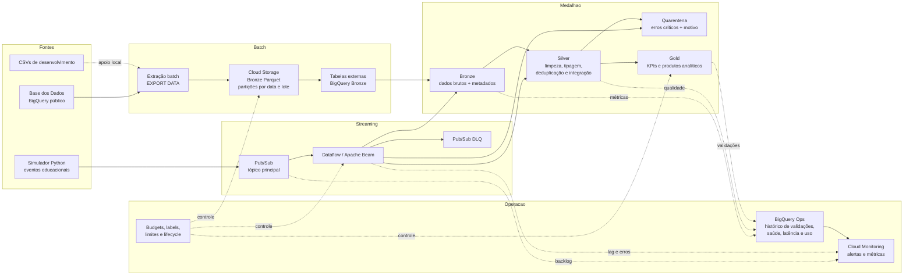
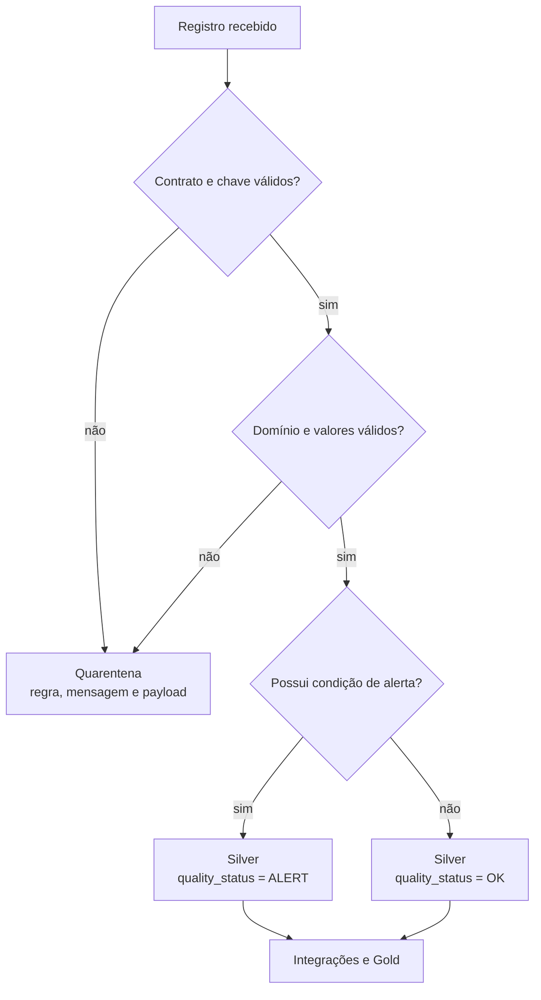

# Tech Challenge — Fase 2

## Pipeline híbrido para análise da alfabetização no Brasil

Este projeto implementa uma plataforma de dados em nuvem para integrar, tratar e disponibilizar informações do **Indicador Criança Alfabetizada**. A solução combina processamento **batch** e **streaming**, utiliza arquitetura medalhão — **Bronze, Silver e Gold** — e inclui qualidade de dados, quarentena, observabilidade, governança e controles de FinOps.

A implementação foi realizada na **Google Cloud Platform**, com dados públicos da Base dos Dados e serviços gerenciados para reduzir esforço operacional.

---

## Sumário

- [Contexto do problema](#contexto-do-problema)
- [Desafio educacional e indicador de alfabetização](#desafio-educacional-e-indicador-de-alfabetização)
- [Objetivos da solução](#objetivos-da-solução)
- [Fontes de dados](#fontes-de-dados)
- [Arquitetura proposta](#arquitetura-proposta)
- [Fluxo de dados](#fluxo-de-dados)
- [Camadas Bronze, Silver e Gold](#camadas-bronze-silver-e-gold)
- [Tecnologias utilizadas](#tecnologias-utilizadas)
- [Decisões arquiteturais e trade-offs](#decisões-arquiteturais-e-trade-offs)
- [Qualidade de dados](#qualidade-de-dados)
- [Monitoramento e observabilidade](#monitoramento-e-observabilidade)
- [FinOps e controle de custos](#finops-e-controle-de-custos)
- [Segurança e governança](#segurança-e-governança)
- [Produtos analíticos da Gold](#produtos-analíticos-da-gold)
- [Aplicação em inteligência artificial](#aplicação-em-inteligência-artificial)
- [Estrutura do repositório](#estrutura-do-repositório)
- [Como executar](#como-executar)
- [Resultados de validação](#resultados-de-validação)
- [Limitações e próximos passos](#limitações-e-próximos-passos)
- [Documentação técnica](#documentação-técnica)

---

## Contexto do problema

A alfabetização na infância é um dos pilares do desenvolvimento educacional, social e econômico. Dificuldades não identificadas nos primeiros anos escolares podem se acumular ao longo da trajetória do estudante e ampliar desigualdades entre municípios, estados, redes de ensino e grupos sociais.

O **Compromisso Nacional Criança Alfabetizada** mobiliza União, estados, Distrito Federal e municípios para promover a alfabetização ao final do 2º ano do ensino fundamental. Para acompanhar esse objetivo, são necessários dados confiáveis sobre proficiência, participação, resultados territoriais e metas.

O problema de dados não consiste apenas em consultar um indicador isolado. É necessário integrar:

- microdados de alunos;
- resultados agregados por município;
- resultados agregados por UF;
- metas municipais;
- metas estaduais;
- metas nacionais;
- dicionários de categorias e códigos.

Essas fontes possuem granularidades, chaves, formatos e coberturas temporais diferentes. A solução precisa preservar os dados brutos, padronizar conceitos, detectar problemas de qualidade e entregar produtos analíticos comparáveis.

---

## Desafio educacional e indicador de alfabetização

A Pesquisa Alfabetiza Brasil definiu **743 pontos na escala de proficiência do Saeb** como ponto de corte a partir do qual um estudante pode ser considerado alfabetizado.

O **Indicador Criança Alfabetizada** representa o percentual de estudantes que atingem esse patamar. Ele permite:

- acompanhar a evolução da alfabetização;
- comparar resultados com metas anuais;
- identificar desigualdades territoriais;
- localizar municípios e UFs com maior distância da meta;
- apoiar priorização de recursos e políticas públicas.

A política pública possui a ambição de ampliar a alfabetização de todas as crianças. Na base utilizada, as metas anuais do indicador chegam a **80% em 2030**. O projeto preserva os valores oficiais existentes nas fontes, sem substituir metas ausentes ou alterar sua metodologia.

---

## Objetivos da solução

A plataforma foi construída para:

1. ingerir dados históricos por processamento batch;
2. simular atualizações em tempo quase real por streaming;
3. preservar o histórico completo na Bronze;
4. limpar, tipar, padronizar e integrar dados na Silver;
5. separar registros inválidos em quarentena;
6. disponibilizar indicadores confiáveis na Gold;
7. monitorar reconciliação, qualidade, volume e latência;
8. aplicar segurança com menor privilégio;
9. controlar custos de armazenamento e processamento;
10. preparar dados para análises estatísticas e futuros modelos de IA.

---

## Fontes de dados

Origem principal:

```text
basedosdados.br_inep_avaliacao_alfabetizacao
```

| Fonte | Registros ingeridos | Cobertura observada | Granularidade principal |
|---|---:|---|---|
| `alunos` | 3.867.999 | 2023–2024 | aluno e ano |
| `municipio` | 23.995 | 2023–2024 | ano, município, série e rede |
| `uf` | 145 | 2023–2024 | ano, UF, série e rede |
| `meta_alfabetizacao_municipio` | 10.704 | 2023–2024 | ano, município e rede |
| `meta_alfabetizacao_uf` | 81 | 2023–2025 | ano, UF e rede |
| `meta_alfabetizacao_brasil` | 3 | 2023–2025 | ano e rede |
| `dicionario` | 27 | metadado | coluna, código e significado |

As seis primeiras fontes são as entidades obrigatórias. A tabela `dicionario` é uma fonte auxiliar usada para interpretar códigos como rede, presença, preenchimento e alfabetização.

---

## Arquitetura proposta

A arquitetura é híbrida:

- **batch** para dados históricos, metas e resultados consolidados;
- **streaming** para simular atualizações de indicadores, metas e medições;
- **Cloud Storage** como data lake da camada Bronze;
- **BigQuery** como mecanismo analítico das camadas Silver, Gold e operações;
- **Pub/Sub + Dataflow** para o fluxo orientado a eventos;
- **Cloud Monitoring e Cloud Logging** para observabilidade.



A documentação detalhada está em [`docs/arquitetura/arquitetura-final.md`](docs/arquitetura/arquitetura-final.md).

---

## Fluxo de dados

### Fluxo batch

1. As tabelas públicas são consultadas no BigQuery.
2. Cada fonte é exportada para Cloud Storage em Parquet com compressão Snappy.
3. O caminho físico registra `ingestion_date` e `batch_id`.
4. Os arquivos recebem metadados técnicos:
   - `_ingestion_timestamp`;
   - `_batch_id`;
   - `_source_table`.
5. Tabelas externas do BigQuery catalogam a Bronze.
6. A quantidade de registros é reconciliada com a origem.
7. A Silver aplica limpeza, tipagem, dicionário, deduplicação e regras de qualidade.
8. Registros com erro crítico seguem para quarentena.
9. Registros válidos são integrados e materializados.
10. A Gold calcula indicadores, metas, gaps, evolução, rankings, cobertura e features.

### Fluxo streaming

1. O simulador cria eventos JSON com contrato versionado.
2. Os eventos são publicados no tópico `alfabetizacao-eventos`.
3. O Dataflow consome a assinatura `alfabetizacao-eventos-dataflow`.
4. Toda mensagem é preservada na Bronze, inclusive mensagens inválidas.
5. Eventos válidos são tipados e enviados para a Silver.
6. Eventos inválidos são enviados para:
   - tabela de quarentena;
   - tópico de dead-letter queue.
7. A solução preserva:
   - `event_time`;
   - `pubsub_publish_time`;
   - `processing_timestamp`.
8. As métricas de volume e latência são consolidadas no dataset de operações.
9. Após o teste, o job é encerrado por **drain** para evitar custo ocioso.

### Fluxo de qualidade



---

## Camadas Bronze, Silver e Gold

### Bronze — dados brutos

Responsabilidades:

- preservar os dados como recebidos;
- manter histórico por data e lote;
- armazenar Parquet no Cloud Storage;
- preservar mensagens streaming brutas;
- adicionar apenas metadados técnicos;
- permitir reprocessamento e auditoria.

Principais objetos:

```text
gs://fiap-tc-f2-camila-takemoto-alfabetizacao-bronze/batch/
alfabetizacao_bronze.ext_alunos
alfabetizacao_bronze.ext_municipio
alfabetizacao_bronze.ext_uf
alfabetizacao_bronze.ext_meta_alfabetizacao_brasil
alfabetizacao_bronze.ext_meta_alfabetizacao_uf
alfabetizacao_bronze.ext_meta_alfabetizacao_municipio
alfabetizacao_bronze.ext_dicionario
alfabetizacao_bronze.streaming_eventos_raw
```

### Silver — dados tratados e integrados

Responsabilidades:

- padronização de tipos e nomes;
- interpretação de códigos pelo dicionário;
- normalização de rede;
- deduplicação;
- transformação das metas do formato largo para o formato longo;
- validação de domínios e chaves;
- agregação segura de microdados;
- integração entre resultados e metas;
- geração de alertas sem substituir `NULL` por zero.

Principais objetos:

```text
alfabetizacao_silver.alunos
alfabetizacao_silver.resultado_municipio
alfabetizacao_silver.resultado_uf
alfabetizacao_silver.meta_brasil
alfabetizacao_silver.meta_uf
alfabetizacao_silver.meta_municipio
alfabetizacao_silver.agg_alunos_municipio
alfabetizacao_silver.int_alunos_resultado_municipio
alfabetizacao_silver.int_municipio_meta
alfabetizacao_silver.int_uf_meta
alfabetizacao_silver.int_brasil_meta
alfabetizacao_silver.streaming_eventos
```

### Gold — produtos analíticos

Responsabilidades:

- comparação entre resultado e meta;
- evolução temporal;
- ranking e quartis;
- cobertura de integração;
- visão executiva;
- distribuição dos níveis de proficiência;
- preparação de atributos para IA.

Principais objetos:

```text
alfabetizacao_gold.kpi_brasil
alfabetizacao_gold.kpi_uf
alfabetizacao_gold.kpi_municipio
alfabetizacao_gold.cobertura_integracao
alfabetizacao_gold.distribuicao_niveis_uf
alfabetizacao_gold.resumo_executivo
alfabetizacao_gold.features_modelo_municipio
alfabetizacao_gold.vw_streaming_eventos_resumo
alfabetizacao_gold.vw_streaming_ultimos_eventos
```

---

## Tecnologias utilizadas

| Tecnologia | Uso no projeto | Justificativa |
|---|---|---|
| Google Cloud Platform | ambiente da solução | As fontes já estão no BigQuery e a GCP oferece integração nativa entre armazenamento, consulta, streaming e monitoramento. |
| BigQuery | consulta, transformação, Silver, Gold e Ops | Serviço serverless, adequado a dados estruturados e SQL analítico, sem necessidade de administrar cluster. |
| Cloud Storage | Bronze batch | Armazenamento de objetos durável, econômico e desacoplado da computação. |
| Parquet + Snappy | formato da Bronze | Formato colunar e comprimido, reduzindo armazenamento e leitura. |
| Pub/Sub | entrada streaming e DLQ | Mensageria gerenciada, desacoplamento entre produtor e consumidor e suporte a retentativas. |
| Dataflow | processamento streaming | Execução gerenciada de Apache Beam, escalável e integrada ao Pub/Sub e BigQuery. |
| Apache Beam | lógica do pipeline streaming | Modelo portável para validação, roteamento e transformação de eventos. |
| Python | simulador e pipeline streaming | Adequado para geração de eventos, validação de JSON e integração com Beam. |
| Bash | automação e execução | Scripts simples e reprodutíveis no Cloud Shell. |
| SQL / GoogleSQL | transformações e qualidade | Processa os dados próximos ao armazenamento, evitando movimentação para notebooks locais. |
| Cloud Monitoring | alertas operacionais | Métricas gerenciadas de Pub/Sub e Dataflow. |
| Cloud Logging | investigação de falhas | Centralização de logs e alerta de erros do Dataflow. |
| IAM e contas de serviço | segurança | Separação de identidades e aplicação de menor privilégio. |
| Git e GitHub | versionamento | Histórico, branches, commits e Pull Requests da evolução da solução. |

### Tecnologias não adotadas

**Spark/Dataproc** não foi usado no batch porque o volume atual é estruturado e já está no BigQuery. Um cluster permanente aumentaria custo e complexidade sem benefício proporcional.

**NoSQL** e **banco vetorial** não foram incluídos porque os dados e padrões de acesso deste desafio são predominantemente relacionais e analíticos.

---

## Decisões arquiteturais e trade-offs

### Batch vs streaming

**Batch** foi escolhido para fontes históricas e metas, pois:

- os dados são publicados de forma periódica;
- a carga completa é simples de auditar;
- o custo é previsível;
- a consistência é mais importante que latência de segundos.

**Streaming** foi usado para simular atualizações de indicadores e resultados, pois:

- demonstra arquitetura orientada a eventos;
- reduz a defasagem entre produção e consumo;
- permite validação e quarentena em tempo quase real.

Trade-off: o streaming possui maior custo e complexidade operacional. Por isso, o job foi limitado a um worker e encerrado após a demonstração.

### Data lake vs data warehouse

A solução combina os dois modelos:

- **data lake:** Cloud Storage na Bronze, preservando arquivos Parquet e histórico;
- **data warehouse:** BigQuery na Silver e Gold, com esquema, SQL, integração e produtos analíticos.

Essa combinação preserva flexibilidade e reprocessamento sem abrir mão de governança e desempenho para consumo.

### Custo vs performance

Decisões adotadas:

- Parquet e Snappy reduzem leitura e armazenamento;
- partições evitam varreduras completas;
- clusterização melhora filtros por chaves territoriais;
- consultas possuem `maximum_bytes_billed`;
- Dataflow opera com um worker no cenário acadêmico;
- o job streaming é drenado ao final;
- resultados complexos são materializados na Gold;
- arquivos temporários possuem lifecycle;
- Bronze histórica não é apagada.

Trade-off observado: o uso de apenas um worker reduziu custo, mas a latência média do teste ficou próxima de **144 segundos**. O resultado atende à demonstração em tempo quase real, não a um SLA de baixa latência em produção.

### BigQuery vs cluster Spark

BigQuery foi priorizado por:

- proximidade com a origem;
- processamento serverless;
- SQL acessível;
- escala suficiente para o volume observado;
- menor esforço operacional.

Spark passaria a ser justificável caso o projeto recebesse dados semiestruturados em escala muito maior, transformações não expressáveis em SQL ou necessidade de processamento distribuído customizado.

### Tabelas nativas vs views

- tabelas nativas são usadas para produtos que exigem desempenho previsível e validação;
- views são usadas para apresentar estados derivados e dados streaming sem duplicar armazenamento.

---

## Qualidade de dados

A solução implementa regras críticas e alertas.

### Regras críticas

Exemplos:

- chave obrigatória ausente;
- duplicidade de chave candidata;
- taxa ou participação fora de 0–100;
- código territorial inválido;
- categoria não encontrada no dicionário;
- proficiência negativa;
- peso de aluno inválido;
- JSON malformado;
- contrato de evento inválido.

Registros críticos não avançam para a Silver. Eles são gravados em quarentena com:

```text
source_table
record_key ou event_id
quality_rules ou error_code
quality_message ou error_message
payload_json ou raw_message
detected_at
batch_id ou simulation_run_id
```

### Alertas

Exemplos:

- meta ausente;
- participação ausente;
- níveis de proficiência indisponíveis;
- inconsistência condicional entre presença e proficiência;
- resultado sem meta;
- meta sem resultado;
- baixa cobertura de integração.

Alertas permanecem na Silver com `quality_status = 'ALERT'`, preservando o dado e sua limitação.

### Validações automatizadas

O pipeline verifica:

- reconciliação entre origem, Bronze, Silver e quarentena;
- unicidade;
- domínios;
- campos obrigatórios;
- chaves de relacionamento;
- consistência de metas;
- cobertura territorial;
- soma de percentuais;
- latências não negativas;
- correspondência de horário de publicação entre Bronze e Silver.

---

## Monitoramento e observabilidade

O dataset:

```text
alfabetizacao_ops
```

centraliza a operação.

Principais objetos:

```text
latest_silver_validation
latest_gold_validation
latest_streaming_validation
latest_ops_validation
silver_validation_history
gold_validation_history
streaming_validation_history
pipeline_health_history
streaming_latency_summary
bigquery_usage_daily
vw_pipeline_health_latest
vw_quality_failures
vw_bigquery_usage_summary
```

### Métricas monitoradas

- quantidade de testes executados;
- testes aprovados e reprovados;
- status consolidado de cada pipeline;
- volume de eventos bruto, válido e inválido;
- latência média, P95 e máxima;
- backlog do Pub/Sub;
- idade da mensagem não confirmada mais antiga;
- system lag do Dataflow;
- falhas do Dataflow;
- jobs de consulta do BigQuery;
- bytes processados e faturados;
- cache hits;
- consultas com erro.

### Alertas configurados

```text
FIAP - PubSub backlog alto
FIAP - PubSub mensagem antiga
FIAP - Dataflow system lag alto
FIAP - Erro no Dataflow
```

Os testes mais recentes indicaram:

```text
silver_batch  SUCCEEDED
gold_batch    SUCCEEDED
streaming     SUCCEEDED
```

---

## FinOps e controle de custos

A arquitetura aplica controles em três níveis.

### Armazenamento

- Bronze em Parquet com Snappy;
- particionamento Hive por `ingestion_date` e `batch_id`;
- lifecycle de um dia somente para `tmp/`;
- preservação do histórico em `batch/`;
- prevenção de duplicação desnecessária por materialização seletiva.

### Processamento

- seleção explícita de colunas;
- filtros por ano e partição;
- tabelas particionadas e clusterizadas;
- limites de bytes por consulta;
- execução sob demanda;
- Dataflow limitado a um worker;
- drain imediato após a demonstração;
- ausência de cluster permanente.

### Governança financeira

- orçamento e alertas de faturamento;
- labels por projeto, ambiente e camada;
- histórico de uso do BigQuery;
- visibilidade de jobs com falha;
- documentação de estimativa de custos.

Uso observado durante o desenvolvimento:

```text
Jobs de consulta:          165
Jobs com falha:              7
Cache hits:                  19
Bytes processados:   3.679.997.903
Bytes faturados:     5.069.864.960
TiB faturados:         0,00461102
Bronze inicial:          71,18 MiB
```

Os sete jobs com falha incluem erros de desenvolvimento registrados antes das correções. Eles são mantidos como histórico operacional.

---

## Segurança e governança

Medidas implementadas:

- contas de serviço separadas:
  - `sa-batch-ingestion`;
  - `sa-streaming-dataflow`;
- impersonação com credenciais temporárias;
- nenhuma chave JSON persistente;
- papéis específicos em vez de `Owner` ou `Editor`;
- permissões concedidas por dataset e bucket;
- acesso uniforme no Cloud Storage;
- prevenção de acesso público;
- separação lógica dos datasets por camada;
- labels em datasets e recursos;
- contrato versionado de eventos;
- rastreabilidade por lote, origem e timestamps;
- microdados individuais restritos à Silver;
- consumo preferencial por produtos agregados da Gold.

---

## Produtos analíticos da Gold

### Indicadores nacionais

`kpi_brasil` contém:

- resultado nacional;
- meta do ano;
- gap em pontos percentuais;
- participação;
- evolução anual;
- status da meta.

### Indicadores por UF

`kpi_uf` contém:

- resultado e meta;
- diferença para o Brasil;
- ranking;
- percentil;
- quartil;
- evolução;
- cobertura da integração.

### Indicadores municipais

`kpi_municipio` contém:

- resultado publicado;
- meta;
- gap;
- participação;
- proficiência;
- presença;
- indicadores calculados a partir de microdados;
- divergência entre microdados e resultado publicado;
- ranking e quartil.

### Resultados observados

Em 2024:

```text
Resultado nacional:                   59,2%
Meta nacional:                        59,9%
Gap:                                  -0,7 pp
UFs comparáveis que atingiram meta:   45,83%
Municípios comparáveis na meta:       53,29%
```

Em 2025:

```text
Resultado nacional:                   66,0%
Meta nacional:                        64,0%
Gap:                                  +2,0 pp
```

Os resultados detalhados por UF e município da fonte utilizada terminam em 2024. A Gold preserva essa ausência como cobertura, sem preencher valores inexistentes com zero.

### Streaming

Teste realizado:

```text
Eventos recebidos na Bronze: 15
Eventos válidos na Silver:   12
Eventos inválidos:            3
Duplicidades:                 0
```

Erros simulados:

```text
CONTRACT_VALIDATION_ERROR: 2
INVALID_JSON:              1
```

---

## Aplicação em inteligência artificial

A tabela:

```text
alfabetizacao_gold.features_modelo_municipio
```

prepara atributos municipais e um possível alvo temporal.

### Modelos de predição de alfabetização

Possíveis problemas:

- prever a taxa do município no ano seguinte;
- estimar risco de não atingir a meta;
- identificar probabilidade de queda do indicador;
- estimar faixas de desempenho.

Atributos possíveis:

- taxa atual;
- variação anual;
- participação;
- média de proficiência;
- presença;
- preenchimento;
- distribuição por níveis;
- gap para a meta;
- histórico territorial.

Para um modelo confiável, é necessário incorporar mais anos e validar separação temporal para evitar vazamento de dados.

### Análise de desigualdade educacional

A Gold permite:

- comparar municípios e UFs;
- medir dispersão e extremos;
- identificar quartis de desempenho;
- localizar territórios persistentemente abaixo da meta;
- avaliar cobertura e participação;
- criar clusters de vulnerabilidade.

O enriquecimento futuro com Censo Escolar, IBGE, Atlas do Desenvolvimento Humano, CadÚnico e FUNDEB pode adicionar contexto socioeconômico e de infraestrutura.

### Políticas públicas baseadas em dados

Possíveis aplicações:

- priorização de assistência técnica;
- direcionamento de formação docente;
- seleção de territórios para intervenção;
- acompanhamento de metas;
- avaliação de evolução após políticas;
- construção de painéis de risco e alerta.

Modelos não devem substituir decisão pública. Devem possuir explicabilidade, avaliação de viés, documentação, monitoramento e revisão humana.

Mais detalhes em [`docs/ia/aplicacoes-ia.md`](docs/ia/aplicacoes-ia.md).

---

## Estrutura do repositório

```text
fiap-tech-challenge-fase2/
├── README.md
├── docs/
│   ├── arquitetura/
│   │   ├── arquitetura-final.md
│   │   └── decisoes-arquiteturais.md
│   ├── dados/
│   │   ├── contrato-eventos-streaming.md
│   │   ├── dicionario-gold.md
│   │   ├── inventario_fontes.md
│   │   ├── matriz-acesso.md
│   │   ├── modelo_dados.md
│   │   └── regras_qualidade.md
│   ├── gcp/
│   ├── finops/
│   ├── ia/
│   ├── operacao/
│   └── entrega/
├── infra/
│   └── gcp/
│       ├── bootstrap.sh
│       ├── setup_streaming.sh
│       ├── setup_ops_governance.sh
│       ├── validate_ops_governance.sh
│       ├── storage-lifecycle.json
│       └── alert-policies/
├── sql/
│   ├── discovery/
│   ├── silver/
│   ├── gold/
│   ├── streaming/
│   └── ops/
├── src/
│   ├── batch/
│   ├── silver/
│   ├── gold/
│   ├── streaming/
│   └── ops/
└── tests/
```

O diretório `tests/` pode permanecer reservado para testes unitários futuros. As validações obrigatórias do projeto estão implementadas nos scripts `validate_*.sh` e nos SQLs de validação de cada camada.

---

## Como executar

### Variáveis

```bash
export PROJECT_ID="fiap-tc-f2-camila-takemoto"
export LOCATION="US"
export DATAFLOW_REGION="us-central1"
export BUCKET="fiap-tc-f2-camila-takemoto-alfabetizacao-bronze"

export SA_BATCH="sa-batch-ingestion@${PROJECT_ID}.iam.gserviceaccount.com"
export SA_STREAMING="sa-streaming-dataflow@${PROJECT_ID}.iam.gserviceaccount.com"
```

### Batch Bronze

```bash
./src/batch/export_bronze.sh
source /tmp/fiap_last_batch.env
./src/batch/create_external_tables.sh
./src/batch/validate_bronze.sh
```

### Silver

```bash
./src/silver/run_silver.sh
./src/silver/validate_silver.sh
```

### Gold

```bash
./src/gold/run_gold.sh
./src/gold/validate_gold.sh
```

### Streaming

```bash
./infra/gcp/setup_streaming.sh
./src/streaming/run_streaming.sh
./src/streaming/run_simulator.sh
source /tmp/fiap_simulation.env
./src/streaming/validate_streaming.sh
./src/streaming/stop_streaming.sh
```

### Observabilidade e governança

```bash
./infra/gcp/setup_ops_governance.sh
./src/ops/run_observability.sh
./src/ops/validate_observability.sh
./infra/gcp/validate_ops_governance.sh
```

A sequência detalhada e os pré-requisitos estão em [`docs/operacao/execucao-e-validacao.md`](docs/operacao/execucao-e-validacao.md).

---

## Resultados de validação

### Bronze

Todas as fontes foram reconciliadas:

```text
alunos:                         3.867.999 = 3.867.999
meta_alfabetizacao_brasil:              3 = 3
meta_alfabetizacao_municipio:      10.704 = 10.704
meta_alfabetizacao_uf:                 81 = 81
municipio:                         23.995 = 23.995
uf:                                   145 = 145
dicionario:                            27 = 27
```

### Silver

- 13 testes aprovados;
- nenhuma duplicidade nas chaves verificadas;
- nenhuma taxa ou meta inválida;
- reconciliações completas;
- quarentena batch vazia no lote executado.

### Gold

- 19 testes aprovados;
- sete produtos analíticos reconciliados;
- unicidade e domínios válidos;
- cobertura somando 100% por ano e nível.

### Streaming

- 8 testes aprovados;
- 15 eventos na Bronze;
- 12 eventos válidos;
- 3 eventos inválidos;
- nenhuma duplicidade;
- quarentena com motivo.

### Observabilidade

- 11 testes aprovados;
- três pipelines com status `SUCCEEDED`;
- métricas de latência não negativas;
- uso do BigQuery coletado;
- correspondência Bronze–Silver para horários de publicação.

---

## Limitações e próximos passos

1. O detalhamento territorial termina em 2024, enquanto o nível nacional já possui 2025.
2. Há poucos anos para treinar modelos temporais robustos.
3. O projeto preserva código municipal, mas ainda não adiciona nome, UF e região por dimensão territorial.
4. O streaming é simulado, não originado de um sistema transacional real.
5. A execução batch é acionada por scripts, sem agendador gerenciado.
6. O Dataflow foi configurado para demonstração com um worker.
7. A solução não implementa dashboard, pois ele não é obrigatório; a Gold está pronta para consumo.
8. Para produção, recomenda-se:
   - Cloud Scheduler e Workflows;
   - CI/CD;
   - testes unitários;
   - ambientes dev/homologação/produção;
   - catálogo e lineage gerenciado;
   - mais anos e enriquecimento externo;
   - definição formal de SLA e SLO.

---

## Documentação técnica

| Documento | Conteúdo |
|---|---|
| [`docs/documentacao-tecnica.md`](docs/documentacao-tecnica.md) | visão técnica completa |
| [`docs/arquitetura/arquitetura-final.md`](docs/arquitetura/arquitetura-final.md) | componentes, diagrama e fluxo |
| [`docs/arquitetura/decisoes-arquiteturais.md`](docs/arquitetura/decisoes-arquiteturais.md) | decisões e trade-offs |
| [`docs/operacao/execucao-e-validacao.md`](docs/operacao/execucao-e-validacao.md) | runbook de execução |
| [`docs/operacao/monitoramento-finops.md`](docs/operacao/monitoramento-finops.md) | observabilidade, custos e governança |
| [`docs/ia/aplicacoes-ia.md`](docs/ia/aplicacoes-ia.md) | uso responsável da Gold em IA |
| [`docs/entrega/checklist-repositorio.md`](docs/entrega/checklist-repositorio.md) | conferência da entrega |

---

## Responsável

Camila Takemoto Bertolini — FIAP Pós-Tech, Tech Challenge Fase 2.
