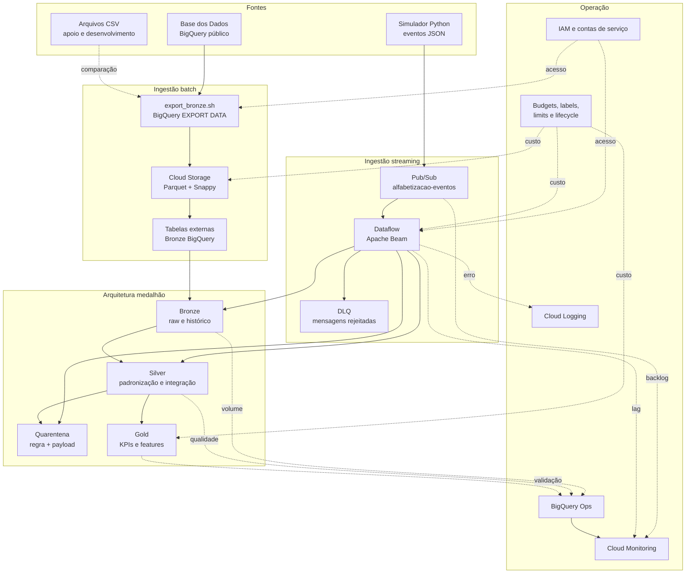
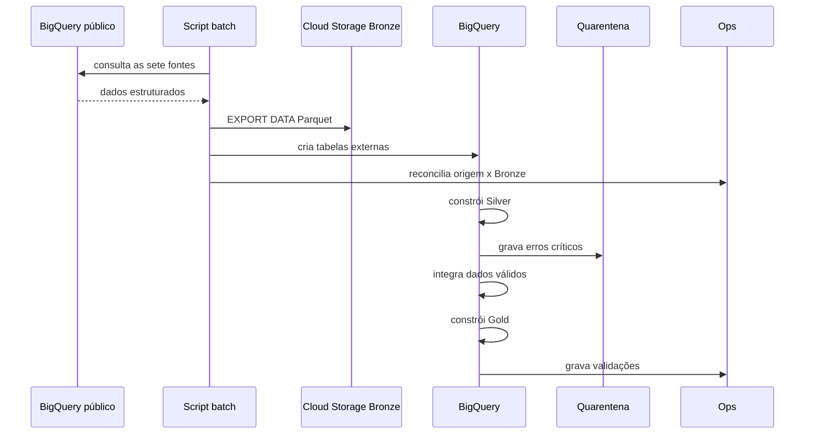
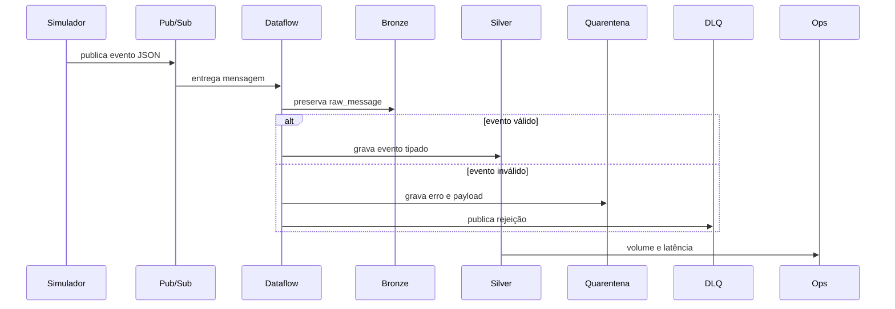

# Arquitetura final

## Princípios

1. preservar o dado antes de transformá-lo;
2. processar próximo ao armazenamento;
3. separar dados inválidos de dados confiáveis;
4. manter rastreabilidade por lote e evento;
5. desacoplar produtores e consumidores;
6. aplicar custo como requisito arquitetural;
7. disponibilizar produtos analíticos, não apenas tabelas técnicas.

## Diagrama



## Fluxo batch



## Fluxo streaming



## Topologia dos dados

```text
Fonte pública
  └── snapshot batch
      └── Cloud Storage Bronze
          └── tabela externa Bronze
              └── Silver tipada e integrada
                  ├── Quarentena
                  └── Gold analítica

Simulador
  └── Pub/Sub
      └── Dataflow
          ├── Bronze raw
          ├── Silver válida
          ├── Quarentena
          └── DLQ
```

## Escalabilidade

O projeto usa serviços serverless ou gerenciados. BigQuery escala o processamento analítico sem cluster dedicado. Pub/Sub desacopla produtor e consumidor. Dataflow pode aumentar workers quando houver necessidade real.

No ambiente acadêmico, o autoscaling foi restringido para reduzir custo. Em produção, quantidade mínima, máxima e política de autoscaling devem ser definidas com base em backlog, latência e SLA.
