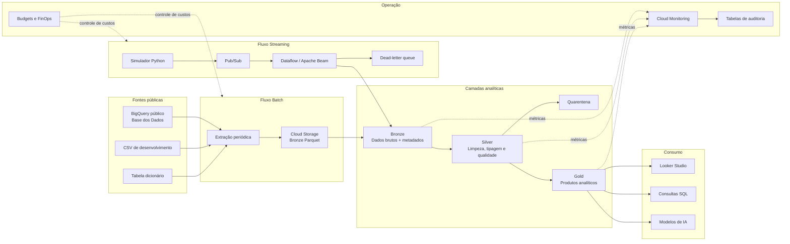

# Arquitetura da solução

## Visão geral

A solução utiliza arquitetura medalhão e combina ingestão batch e streaming.

## Componentes

### BigQuery público

Origem principal dos dados históricos disponibilizados pela Base dos Dados.

### Cloud Storage

Armazena snapshots históricos da camada Bronze em formato Parquet,
preservando os dados como foram recebidos.

### BigQuery

Armazena e processa as camadas Silver e Gold.

### Pub/Sub

Recebe os eventos publicados pelo simulador de streaming.

### Dataflow

Valida, transforma e direciona eventos para a Bronze ou para a fila de erros.

### Looker Studio

Consome os produtos analíticos da camada Gold.

### Cloud Monitoring

Acompanha execução, falhas, latência, backlog e registros em quarentena.

## Estratégia de processamento

- Batch para dados históricos e metas.
- Streaming simulado para eventos de atualização.
- ELT para as transformações analíticas dentro do BigQuery.
- Dados inválidos enviados para quarentena.
- Camada Gold composta por produtos de dados agregados.