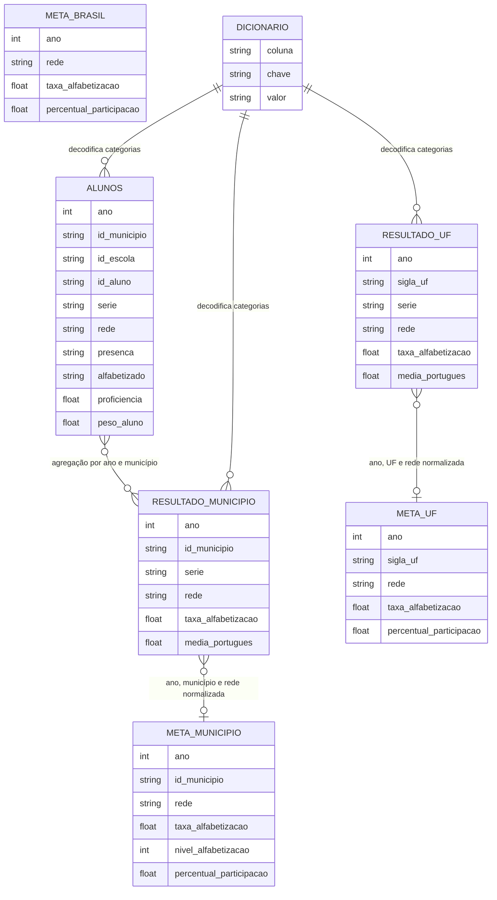

# Modelo de dados

## Modelo das fontes

## Modelo analítico proposto

A camada Gold será organizada por nível territorial.

### Gold Brasil

Grão:

- ano
- rede

Principais métricas:

- taxa de alfabetização;
- meta correspondente ao ano;
- diferença entre resultado e meta;
- percentual de participação;
- variação anual;
- situação da meta.

### Gold UF

Grão:

- ano
- sigla_uf
- rede

Principais métricas:

- taxa de alfabetização;
- meta correspondente ao ano;
- diferença entre resultado e meta;
- média de português;
- participação;
- distribuição por nível;
- posição da UF;
- diferença em relação ao Brasil.

### Gold Município

Grão:

- ano
- id_municipio
- rede

Principais métricas:

- taxa de alfabetização;
- meta correspondente ao ano;
- diferença entre resultado e meta;
- média de português;
- participação;
- nível de alfabetização;
- distribuição dos estudantes por nível.

### Gold Alunos Agregados

Os microdados não serão disponibilizados individualmente para consumo
analítico aberto. Eles serão agregados por município, ano e rede.

Métricas:

- total de alunos;
- total de presentes;
- total com caderno preenchido;
- total alfabetizado;
- taxa de presença;
- taxa de preenchimento;
- taxa de alfabetização calculada;
- proficiência média;
- proficiência ponderada.